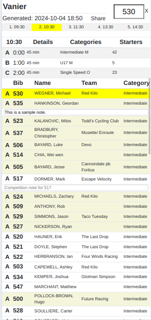
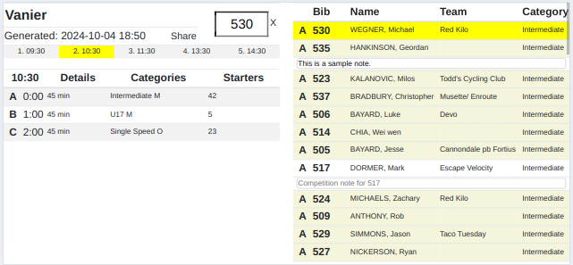

# startlist
# Thu Sep 26 03:58:26 PM PDT 2024

Generation of traditional paper start lists is time-consuming and difficult
at events. 
Everyone has a cell phone capable of displaying a web page.

This script generates an HTML start list for a competition in *RaceDB*.

This is suitable for placing on a static website accessible at the competition.

E.g. This is an S3 bucket configured as a static website:

   [Vanier Example](https://results.wimsey.co/2024/testing/2024-09-22-Vanier-startlist.html)


This is intended primarily for officials and commissaires running the competition
to replace paper start lists. Minimal notes can be entered and shared.

Cookies maintain the notes and selections when the page is refreshed.


The script is written in Python. 

- for a specific date find the corresponding RaceDB competition using SQL
- generates an HTML page that has a list of the events for the competition
- each event also has a list of waves and the number of participants in each wave

That table can be used to select an event or wave. Clicking on an event or wave
will display the start list for that event or wave.

Features:
- portrait and landscape display
- iPhone and iPad display
- sorting by column
- competition notes
- sharing notes

N.B. This script will require network access to the computer running RaceDB. The RaceDB/Postgres
container must allow access to port 5432.

## Overview
There are three tables presented.
1. Event name, Bib Search, date file generated, share button, event times for selecting
2. Event information, show all waves with details, categories and number of starters.
3. Wave information, show all participants in an event, or specific wave (click on wave in Event information table)

### Bib Search
Enter a bib number in the bib search input, if found the riders information in the wave table will be highlighted in yellow.

### Rider Competition Notes
Click on a rider to open a competition note field. Riders that have notes will be highlighted in beige.

Click on the "share" button to create a markdown file of all competition notes for download or sharing.

## Screenshots

#### Portrait

 

### Landscape



## Install

```
python setup.py install
```

## Use

```
startlist --date 20240923 --host racedb.wg
```


