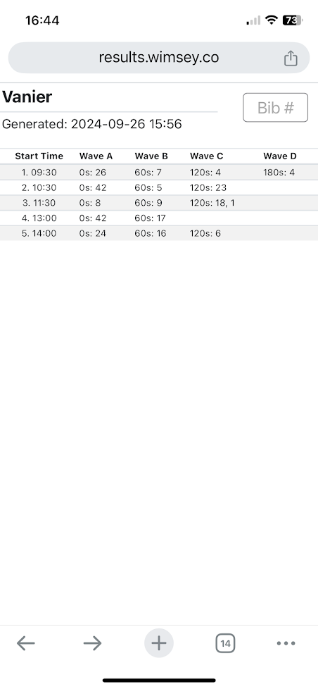
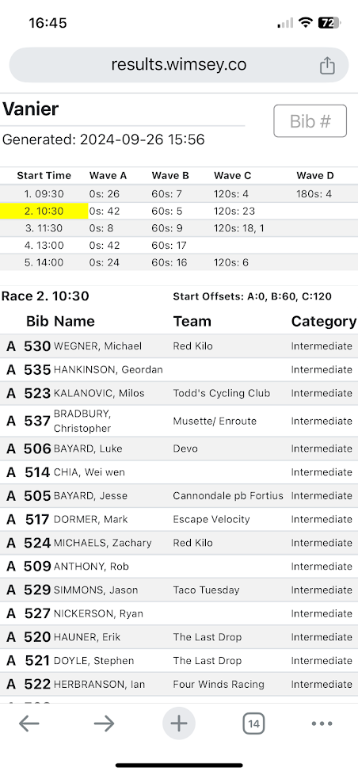
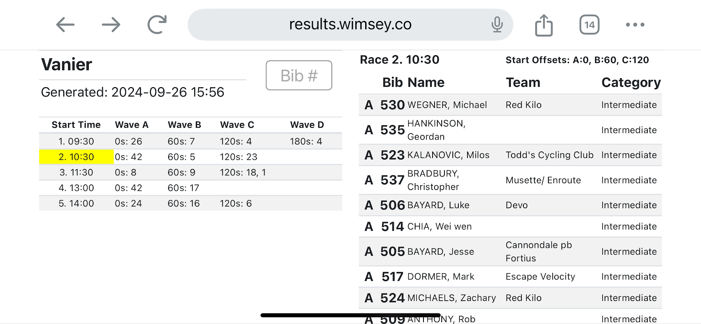
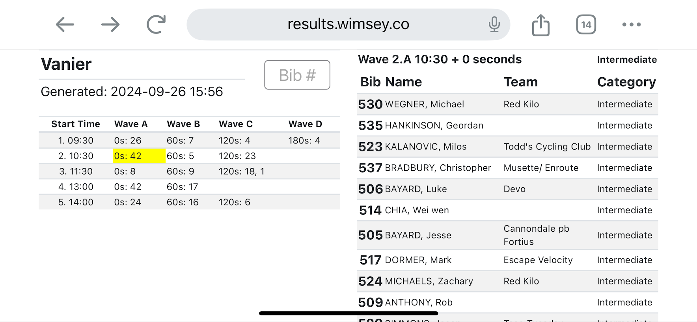

# startlist
# Thu Sep 26 03:58:26 PM PDT 2024

This is a script to generate an HTML startlist for a competition in *RaceDB*.

This is suitable for placing on an website accessible at the competition.

It is intended primarily for use by officials and commissaires running the competition
replacing paper start lists.

Generation of traditional paper start lists is time consuming and everyone has
a cell phone capable of displaying a web page.

The script is written in Python. It:

- for a specific date finds the corresponding RaceDB competition using SQL
- generates an HTML page that has a list of the events for the competition
- each event also has the list of waves and number of participants in each wave

That table can be used to select and event or wave. Clicking on an event or wave
will display the start list for that event or wave.

Features:
- portrait and landscape display
- iPhone and iPad display
- sorting by column

## Samples

The following are samples of the output of the script.

#### Portrait
| | | |
|||[wave-portrait](./img/wave-portrait.png)|
| | | |

#### Landscape
| | | |
|||[wave-portrait](./img/search-landscape-portrait.png)|
| | | |

